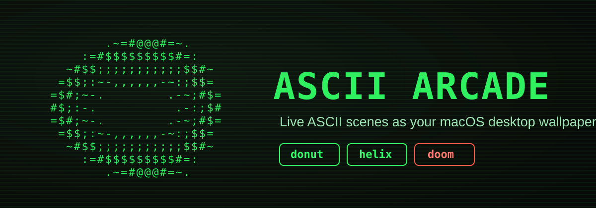
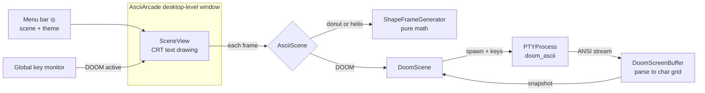

<p align="center">
  <picture>
    <source media="(prefers-color-scheme: dark)"  srcset="assets/banner-dark.svg">
    <source media="(prefers-color-scheme: light)" srcset="assets/banner-light.svg">
    
  </picture>
</p>

<p align="center">
  <a href="https://github.com/Builder106/ascii-arcade/actions/workflows/ci.yml"></a>
  <a href="https://swift.org"></a>
  
  <a href="#license"></a>
</p>

A macOS live-wallpaper customizer that renders ASCII scenes as your desktop
background. Pick a spinning [Andy Sloane donut](https://www.a1k0n.net/2011/07/20/donut-math.html),
Matrix rain, a crackling fire, Conway's Game of Life, a giant block clock, or
**playable text-mode DOOM** — all drawn straight onto the desktop, behind your
windows.

It started as the merge of two earlier projects: `donut` (the ASCII wallpaper
host) and `DOOM` (text-mode DOOM over a PTY). DOOM is just another *scene*: its
frames are reconstructed from the `doom_ascii` terminal stream and rendered with
the same CRT-styled text drawing as the donut, with keystrokes forwarded so you
can play it as your wallpaper.

## Scenes

| Scene | What it is | Colour | Interactive |
|-------|------------|--------|-------------|
| **Donut** | The classic rotating ASCII torus | theme | — |
| **Helix** | A precessing double-helix variant | theme | — |
| **Matrix** | Falling digital rain with bright heads + fading trails | theme-tinted | — |
| **Fire** | The Doom-fire cellular effect, black→red→orange→white | full colour | — |
| **Life** | Conway's Game of Life, seeded with classic patterns; auto-reseeds when it stalls | theme-tinted | — |
| **Pipes** | The old pipes screensaver in box-drawing glyphs | per-pipe hue | — |
| **Clock** | A large block-digit clock (HH:MM:SS) | theme | — |
| **DOOM** | `doom_ascii` rendered to the desktop, in its native colours | full colour | ✅ keyboard |

Switch scenes and themes from the menu-bar `◎` item, or cycle scenes with **⌘⌥C**.

**Colour.** Scenes can paint each glyph individually: Fire and DOOM use their own
palettes, while Matrix, Life, and the math scenes key off the theme's text colour
(green rain under Hacker, amber rain under Amber, …). Themes: Hacker (green),
Amber, Ice, Ghost.

**Scene Settings.** Each scene exposes a few knobs under *Scene Settings* in the
menu — Matrix speed/density, Fire intensity/wind, Life speed/cell-size, Pipes
speed/count, Clock size/seconds.

**Auto-cycle when idle.** Toggle *Auto-cycle when idle* and ASCII Arcade rotates
through the scenes like a slideshow after ~90 s with no input, then snaps back to
your chosen scene the moment you touch the keyboard or mouse. Rendering also
pauses while the displays sleep.

## DOOM controls

Forwarded to `doom_ascii` while DOOM is the active wallpaper (toggle with
*"Capture keys for DOOM"* in the menu):

| Action | Key |
|--------|-----|
| Move / turn | Arrow keys |
| Strafe | `,` `.` |
| Fire | Space |
| Use / open | `E` |
| Run | `]` |
| Weapons | `1`–`7` |
| Confirm / menu | Return / Esc |

> Playing DOOM as a wallpaper needs **Accessibility** permission (System Settings →
> Privacy & Security → Accessibility) so the app can read keystrokes globally. While
> capture is on, keystrokes drive DOOM regardless of which app is focused.

## Install

ASCII Arcade ships as a normal macOS app — it lives in your menu bar (the `◎`
icon), remembers your scene/theme/settings between launches, and can start at
login. Grab `ASCII-Arcade.dmg` from the [releases page](https://github.com/Builder106/ascii-arcade/releases),
then:

1. Open the DMG and drag **ASCII Arcade** onto **Applications**.
2. Because it isn't notarized (no paid Apple Developer account), Gatekeeper
   blocks the first launch — **right-click (Control-click) the app → Open**,
   then click **Open** in the dialog. macOS remembers it from then on.
   - Terminal equivalent: `xattr -dr com.apple.quarantine "/Applications/ASCII Arcade.app"`
3. Look for the `◎` icon in your menu bar to pick a scene/theme.

The donut and the other math/colour scenes work immediately. **DOOM** is the one
piece that isn't bundled — `doom_ascii` is GPL-2.0, so it's fetched and built
separately (see below); until then the DOOM scene shows a hint.

## Build & run from source

Requires macOS 13+ and a Swift 6 toolchain (Xcode 16+) — the pinned Vapor
release declares Swift tools 6.0.

```bash
./scripts/setup.sh        # fetch + build the GPL doom_ascii binary into ./bin
swift build               # build everything
swift run AsciiArcade     # run the wallpaper app
```

The Freedoom IWADs ship in `wad/`, so DOOM works out of the box. Quitting the app
restores your original wallpaper.

### Package the app yourself

```bash
./scripts/make-app.sh     # assemble dist/ASCII Arcade.app (release build + icon + WADs)
./scripts/make-dmg.sh     # wrap it in dist/ASCII-Arcade.dmg
```

`make-app.sh` ad-hoc signs the bundle and bundles the BSD Freedoom WADs. It does
**not** bundle the GPL `doom_ascii` by default; set `INCLUDE_DOOM=1` to include
it (you then must also redistribute its source). On a cloud-synced checkout, set
`SCRATCH_PATH=/tmp/aa-build` so SwiftPM's `build.db` doesn't choke.

## Browser bonus

DOOM can also be played in a browser tab via a Vapor WebSocket server (xterm.js
frontend) — handy for sharing or for machines without Accessibility access:

```bash
DOOM_PORT=8787 swift run Server   # http://127.0.0.1:8787
```

Optionally, `scripts/install_agent.sh` installs a LaunchAgent that watches for the
hotword `doom` typed anywhere and pops the browser DOOM up automatically.

## Demo

<details>
<summary>Browser DOOM walkthrough</summary>

The browser surface has an automated [playwright-bdd demo suite](e2e/) that boots
the server, plays DOOM, and records a video:

```bash
cd e2e && npm install && npm run demo   # writes e2e/recordings/*.mp4
```

See [e2e/README.md](e2e/README.md) for tuning and how to convert a recording to a
GIF for embedding here.

</details>

> The wallpaper scenes (donut / helix / DOOM on the desktop) are a borderless
> desktop-level overlay, so they're captured with a manual screen recording rather
> than a headless browser — drop those clips under `assets/` and embed them here.

## How it works



- **`AsciiArcadeCore`** — the frame generators, the `AsciiScene` protocol, and the
  DOOM glue (`DoomScreenBuffer` parses the ANSI stream into a char grid;
  `DoomScene` owns the PTY; `DoomLauncher` resolves the binary + IWAD). Colour
  scenes return a `ColoredFrame` (a glyph grid plus a parallel grid of optional
  per-cell `RGBColor`); the stateful ones (Matrix, Fire, Life, Pipes) share a
  `SteppedScene` base that runs a fixed-timestep simulation off the render clock.
- **`PTYBridge`** — spawns `doom_ascii` in a pseudo-terminal and pipes its output.
- **`AsciiArcade`** — the AppKit wallpaper host (scene picker, themes, key forwarding).
- **`Server`** / **`Hotword`** / **`WatcherCLI`** — the optional browser path.

## Layout

```
Sources/AsciiArcadeCore   frame generators + scene/DOOM glue
Sources/PTYBridge         pseudo-terminal wrapper
Sources/AsciiArcade       wallpaper app (executable)
Sources/Server            Vapor browser server (executable, bonus)
Sources/Hotword           hotword detector
Sources/WatcherCLI        hotword → browser daemon (executable, bonus)
wad/                      committed Freedoom IWADs
bin/                      doom_ascii binary (built by setup.sh)
```

## License

This project's code is MIT — see [LICENSE](LICENSE). Note that `doom_ascii`
([wojciech-graj/doom-ascii](https://github.com/wojciech-graj/doom-ascii)) is
GPL-2.0 and is *fetched and built* by `setup.sh` rather than redistributed here;
the bundled [Freedoom](https://freedoom.github.io/) IWADs are BSD-licensed.
